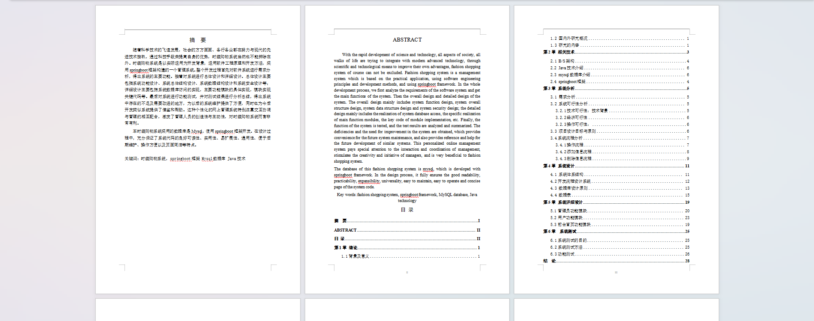
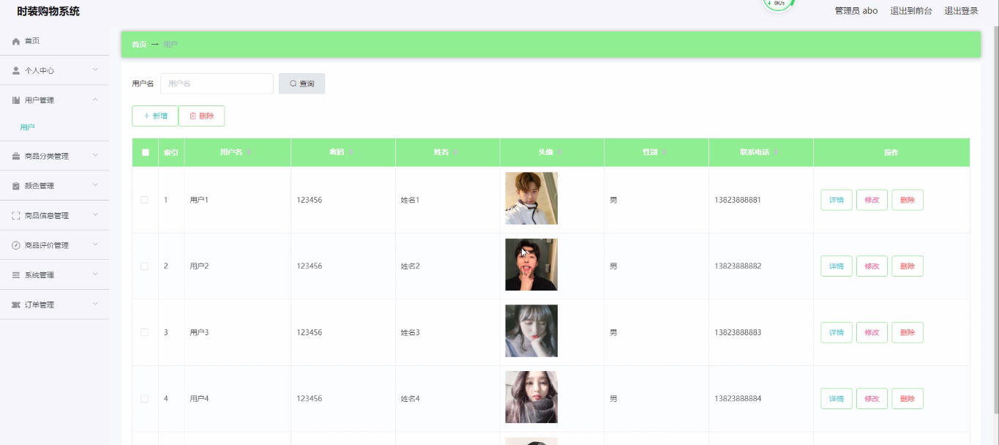
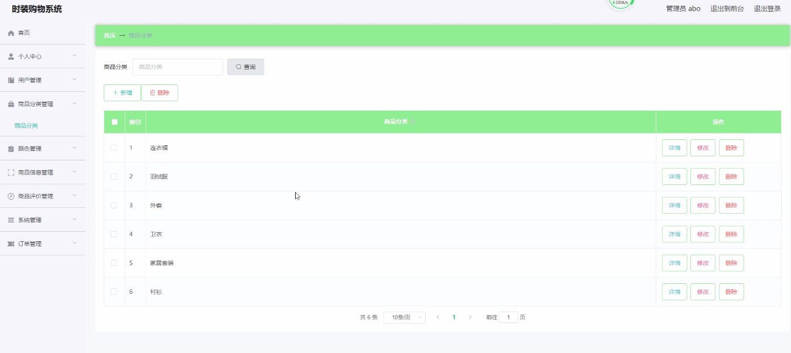
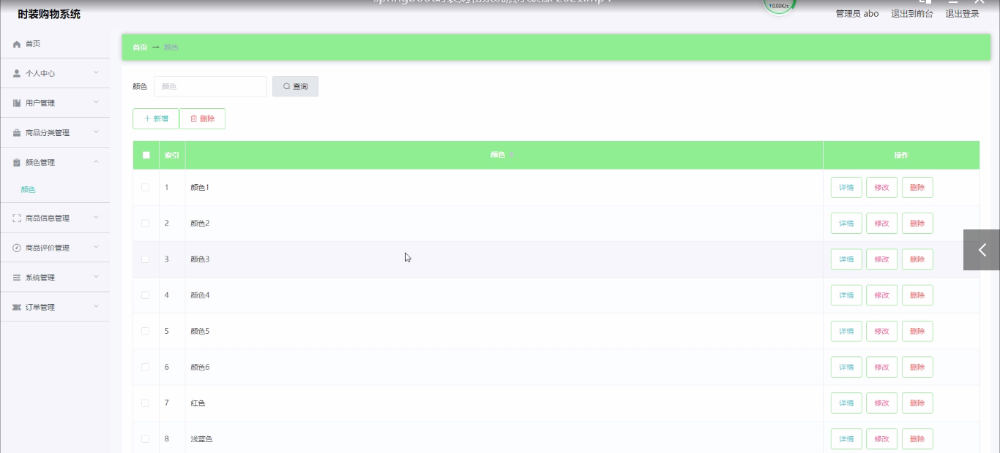
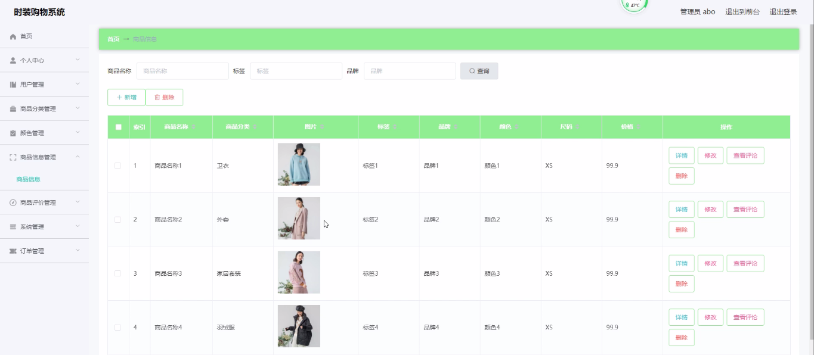
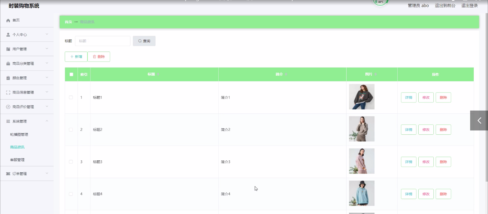

基于Springboot的网页时装购物系统（程序+论文）
=
### 完整代码获取地址：从戎源码网 ([https://armycodes.com/](https://armycodes.com/))
### 作者微信：19941326836  QQ：952045282 
### 承接计算机毕业设计、Java毕业设计、Python毕业设计、深度学习、机器学习
### 选题+开题报告+任务书+程序定制+安装调试+论文+答辩ppt 一条龙服务
### 所有选题地址https://github.com/nature924/allProject

一、项目介绍
---
系统包含两种角色：用户、管理员，系统分为前台和后台两大模块，主要功能如下：
### 1 管理员功能模块
管理员登录: 管理员通过用户名、密码、角色进行登录。
首页和个人中心: 查看系统的总体信息和个人信息。
用户管理: 管理用户的详细信息，进行详情查看、修改。
商品分类管理: 管理商品分类，进行详情查看、修改或删除。
颜色管理: 查看和管理颜色信息，进行详情查看、修改或删除。
商品信息管理: 管理商品的详细信息，包括名称、分类、图片等，进行详情查看、修改或删除。
商品资讯管理: 管理商品的资讯信息，进行详情查看、修改或删除。
轮播图管理: 管理首页轮播图，添加、修改或删除图片。
客服管理: 查看和管理客服消息和状态，进行详情查看、修改或删除。
订单管理: 查看和管理订单信息，进行详情查看、修改或删除。

### 2 用户功能模块
用户登录: 用户通过用户名和密码登录系统。
首页和个人中心: 查看个人信息和系统的总体信息。
商品评价管理: 管理商品评价信息，进行详情查看和修改。
我的收藏管理: 查看和管理收藏的商品，进行修改或删除。
订单管理: 查看和管理订单信息，进行详情查看和删除。

### 3 前台首页功能模块
首页: 查看系统的总体信息。
商品信息: 查看商品的详细信息，进行添加到购物车或立即购买。
商品资讯: 查看商品的资讯信息。
个人中心: 查看个人信息。
后台管理: 进入后台管理系统。
购物车: 查看和管理购物车中的商品。
客服: 查看和管理客服信息。
用户注册: 用户通过注册获取用户名、密码等信息进行注册、登录。
我的订单: 查看和管理订单信息，进行提交。

二、项目技术
---
- 编程语言：Java
- 数据库：MySQL
- 项目管理工具：Maven
- 前端技术：VUE、HTML、Jquery、Bootstrap
- 后端技术：Spring、SpringMVC、MyBatis

三、运行环境
---
- 操作系统：Windows、macOS都可以
- JDK版本：JDK1.8以上都可以
- 开发工具：IDEA、Ecplise、Myecplise都可以
- 数据库: MySQL5.7以上都可以
- Tomcat：任意版本都可以
- Maven：任意版本都可以

四、运行截图
---
### 论文截图：

### 程序截图：

